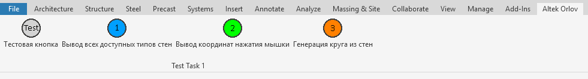
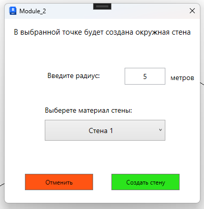
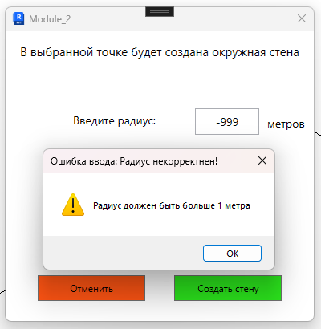
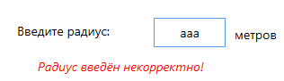
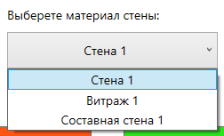
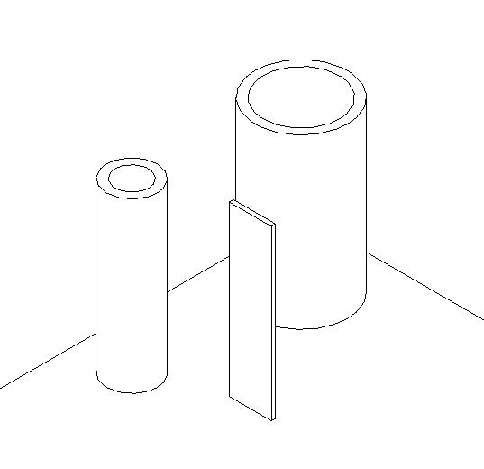
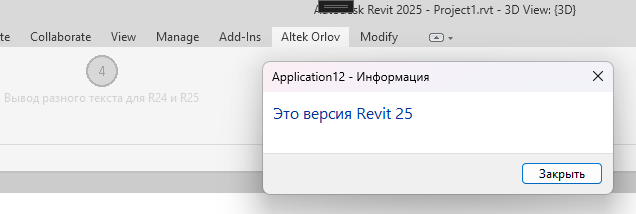
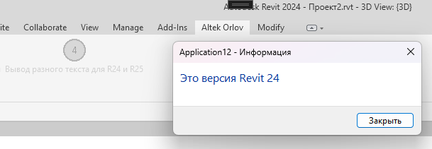

# Учебный проект RevitAddIn12

В этом проекте я создаю решение Solution, на базе инструмента Nice3Point 

*Плагин наипсан для Revit 2024*

---
### Что он делает:

Плагин добавляет вкладку на панели инструментов, с названием "Altek Orlov"

На этой панели отображается 4 разных кнопки:

* Тестовая кнопка просто открывает тестовое окно
* 1 кнопка выводит в окне список всех доступных в документе стен   
* 2 - выводит в 2х разных окнах координаты нажатия мышки (они базируются на уровне 1 по координате Z)
* #### 3 кнопка - основная:

При нажатии на неё, она ждёт, куда нажмёт пользователь в окне редактора, и затем показывает диалоговое окно, в котором просит ввести необходимые параметры для создания окружной стены:

Корректные параметры уже введены в поля, и пользователь может просто нажать кнопку "Создать стену"

#### Обработка ошибок:

При попытке ввести некорректные числовые значения, появится окно с предупреждением, уведомляющее пользователя о том, что ему нужно ввести другое значение

При попытке ввода некорректных данных в поле ввода, например букв и символов, появится красная надпись  
*Ввод запятой возможен в поле ввода*  
*Ввод знака минус также возможен, но выдаст также некорректный результат*  

Далее, пользователь может выбрать материал стены - один из тех, которые есть в проекте

#### Результаты использования кнопки:

Затем, по нажатию кнопки "Создать стену", если все данные введены корректно, на месте нажатия пользователем, появится окружная стена, с указанным радиусом и материалом

*Высота стены будет составлять стандартное значение - от первого до второго уровня документа*  
*Основание стены будет создано на уровне 1*

---

## Есть кнопка для отображения разного текста для разных версий Revit

---

Проект корректно собирается и опубликовывется в .msi файл, используя Nuke

