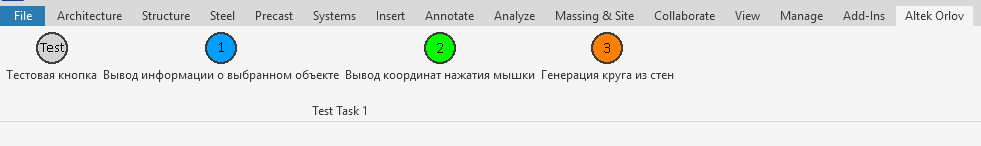

# Учебный проект RevitAddIn12

В этом проекте я создаю решение Solution, на базе инструмента Nice3Point

*Плагин наипсан для Revit 2024*

---
### Что он делает:

Плагин добавляет вкладку на панели инструментов, с названием "Altek Orlov"

На этой панели отображается 4 разных кнопки

---

Проект корректно собирается и опубликовывется в .msi файл, используя Nuke

